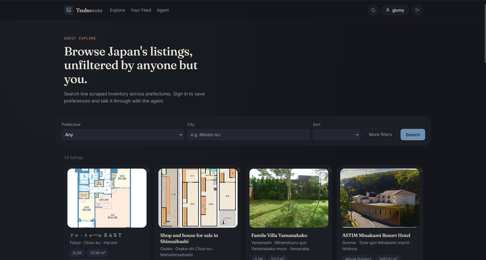
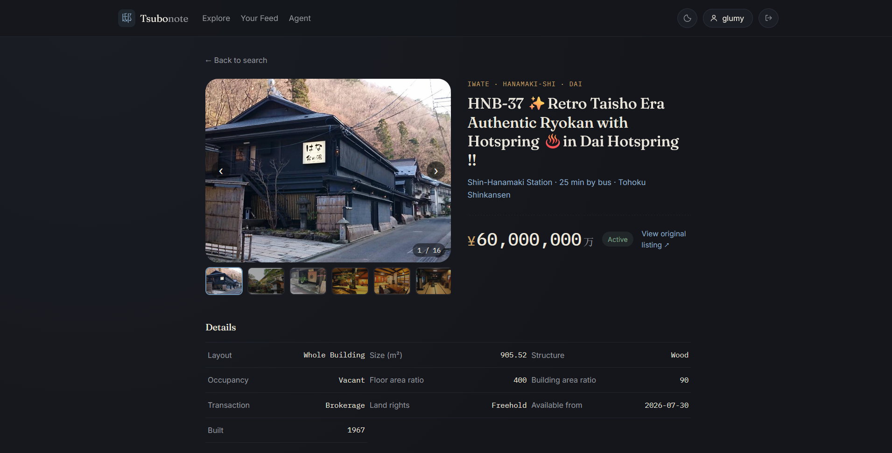
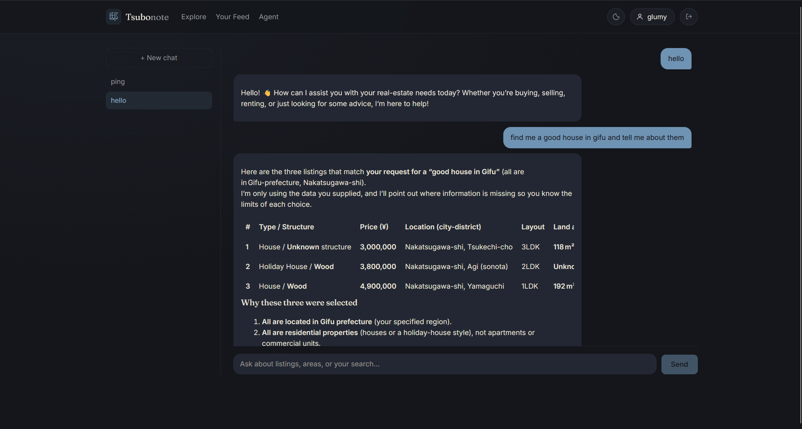
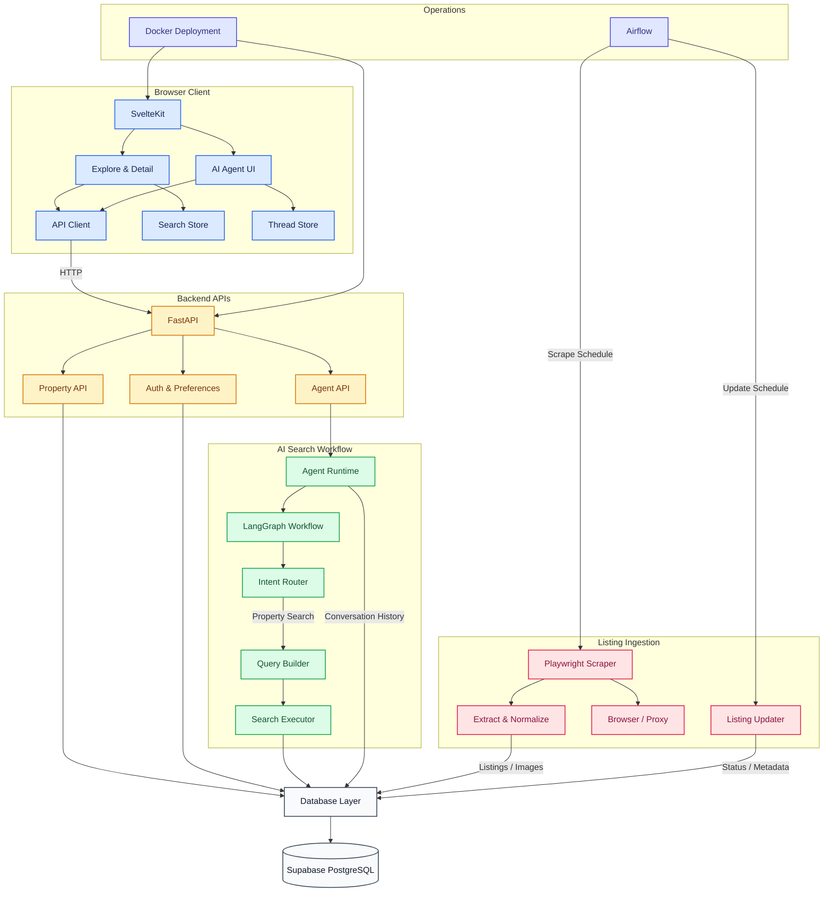

# 邸 Tsubonote — Japanese Real Estate Deal Discovery

> Finding a property in Japan shouldn't require digging through dozens of listings and manually comparing them.

**Tsubonote** is a real-estate discovery platform I built to make Japanese property search easier. It collects and continuously updates listings, supports both structured filters and natural-language search, and provides an AI assistant that can search, explain, and discuss properties.

**Live Demo:** https://tsubonote.vercel.app/
**Backend:** https://tsubonote-api.onrender.com

>Note: The demo runs on free hosting, so the backend may take a minute to wake up and may occasionally be unavailable during updates. Login may also be blocked by browsers that restrict third-party cookies.

---

# Screenshots 

### Explore



Browse scraped Japanese real-estate listings with filtering and sorting.

### Property Details



Each listing has a dedicated detail page with available property information and images.

### AI Agent



Ask the agent for properties using natural language. It searches the
listing database and explains why the returned properties match the request.

---

## What problem is Tsubonote solving?

Real-estate search becomes difficult when the user already has a specific idea of what they want.

A typical search might involve:

* browsing large numbers of listings
* repeatedly applying filters
* comparing similar properties manually
* figuring out which properties actually match an investment strategy
* interpreting large amounts of listing information
* dealing with listings that become outdated or unavailable

Traditional filters are useful when the user knows exactly what to search for.

But requests such as:

> "Find me relatively cheap properties in Chiba with good potential for renovation."

contain intent that is harder to express through a collection of dropdowns.

Tsubonote is an attempt to bridge that gap.

---

## Architecture



---

## What Tsubonote does

### Property Search

Users can search the collected listings using traditional structured filters such as:

* price
* property size
* prefecture
* city / district
* building structure
* zoning
* occupancy
* sorting and pagination

### Natural-Language Search

The AI assistant can interpret a user's request and turn it into a structured property search.

Instead of manually configuring every filter, a user can describe what they are looking for conversationally.

The agent then searches the actual property database rather than generating properties from the model's knowledge.

### Persistent Agent Memory

AI conversations are persisted using PostgreSQL and LangGraph persistence.

Conversation state is associated with the authenticated user, allowing
conversations to continue across sessions.

The required persistence tables are created through the project's
database setup/migration process.

### Property Details

Each listing has a dedicated detail view containing the available property information and images collected from the source.

### AI Assistant

The assistant can:

* understand property-search requests
* query the real listing database
* explain search results
* maintain conversation history
* answer questions about returned properties

### Continuously Updated Listings

Tsubonote is designed around a continuously maintained listing dataset rather
than a one-time scrape.

The scraping and updater pipeline can:

* collect new listings
* follow listings into their detail pages for additional metadata
* collect property image URLs
* detect existing listings
* check whether listings are still active
* update listing metadata
* reconcile missing or inconsistent fields
* store and update property images

The full pipeline can be run locally or through the project's scheduled
workflow. The public demo runs on free hosting, so continuous background
scraping is not enabled there.

---

## Project at a Glance

|                    |                           |
| ------------------ | ------------------------- |
| Listings collected | **9,557+**                |
| ML dataset         | **4,400+ records**        |
| Listing fields     | **~50 fields**            |
| Primary source     | **realestate.co.jp**      |
| Backend            | **Python / FastAPI**      |
| Database           | **PostgreSQL / Supabase** |
| Scraping           | **Playwright**            |
| AI workflow        | **LangGraph**             |
| Frontend           | **SvelteKit**             |
| Deployment         | **Render + Vercel**       |

The numbers above represent the current development dataset and will change as the scraper continues running.

---

## Technical Highlights

### Scraping & Data Pipeline

The scraper uses asynchronous Playwright to collect real-estate listings
from the source website.

Rather than relying only on data visible on listing/search pages, the scraper
follows individual property pages to collect additional metadata and image
URLs.

It currently handles:

* multi-page scraping
* pagination detection
* detail-page extraction
* listing ID extraction
* database upserts
* property image collection
* active/expired listing detection
* metadata updates
* source-specific update logic
* logging and error handling
* proxy support

The updater separates listing-status checks from more expensive metadata
updates. This allows existing listings to be checked for availability more
frequently while limiting full metadata refreshes.

### Database

Property data is stored in PostgreSQL using a structured schema combined with JSONB for source-specific listing information.

The database also stores:

* listing status
* source IDs
* prices
* timestamps
* images
* user accounts
* user preferences
* AI conversation data

Indexes are used for common property-search operations, including active listings and price-based queries.

### AI Agent

The AI system is implemented as a LangGraph workflow rather than a single unrestricted chatbot.

A simplified flow is:

```text
User request
     │
     ▼
Intent / request understanding
     │
     ├── Casual conversation
     │
     └── Property request
              │
              ▼
       Structured query
              │
              ▼
       PostgreSQL search
              │
              ▼
       Result explanation
              │
              ▼
        User response
```

A key design decision is that the agent uses the application's actual property database when answering property-search questions.

The LLM is responsible for interpreting and explaining the request; the database remains the source of truth for available listings.

### Machine Learning

The project also contains an experimental property-price prediction model using CatBoost.

Current experiments use:

* 5,000+ collected listings
* a filtered ML dataset of 4,400+ records
* an 80/20 train/test split
* log-transformed property prices
* CatBoost regression

The current model achieves approximately **0.90 R² in log-price space** on the development dataset.

This component is currently experimental rather than a production pricing service.

---

## Engineering Challenges

This project has involved more than simply connecting an LLM to a database.

### Keeping scraped data current

Listings can disappear or change after they have already been collected.

Tsubonote therefore has separate logic for checking listing status and updating listing metadata instead of assuming that an old scraped record is still valid.

### Handling website changes

The source website has changed its page structure during development, breaking selectors that previously worked.

The scraper has had to be updated to handle those changes while preserving the existing dataset.

### Making the AI use real data

A chatbot that invents plausible properties is not useful for a real-estate application.

The agent therefore follows a database-backed workflow where property-search requests are converted into queries against the actual listing database.

### Browser Automation

The scraper uses Chromium through Playwright, which is considerably more resource-intensive than ordinary HTTP requests. This has required attention to browser lifecycle, memory usage, failure handling, and separating scraping workloads from normal API traffic.

---

## Authentication

Tsubonote uses Google OAuth for user authentication.

The backend:

1. authenticates the user through Google
2. creates or retrieves the application user
3. issues an HTTP-only authentication cookie
4. uses the authenticated user for preferences and conversation history

---

## Project Structure

```text
realestate-agent/
├── ai_agent/          # AI / LangGraph workflows
├── apis/              # FastAPI routes
├── data/              # Temporary and processed data
├── docs/              # Technical documentation
├── frontend/          # SvelteKit application
├── manage_db/         # Database management
├── ml_analysis/       # ML experiments and models
├── scraper/           # Playwright scraper and updaters
├── tests/             # Tests
├── utils/             # Shared utilities and logging
├── .github/            # Github ci workflow 
├── requirements.txt
├── Dockerfile
├── docker-compose.yaml
├── .dockerignore
├── .gitignore
├── pytest.ini
├── LICENSE
└── README.md
```

---

## Documentation

More detailed technical documentation:

* [Database Schema](docs/DB_SCHEMA.md)
* [Database Migration](docs/MIGRATION.md)

More documentation will be added as the system stabilizes.

---

## Running Locally

Please read : [GETTING_STARTED](docs/GETTING_STARTED.md)

---

## Current Status

Tsubonote is an active development project.

The core system is currently functional:

* property scraping
* PostgreSQL storage
* property search
* property details
* Google authentication
* user preferences
* AI-assisted search
* conversation memory
* SvelteKit frontend
* production deployment

The system is still being improved, particularly around production scraping, scheduling, data quality, UI/UX, and recommendation features.

---

## Roadmap

* [ ] More property sources
* [ ] Reliable scheduled scraping and update jobs
* [ ] Better property ranking
* [ ] ML-assisted recommendations
* [ ] User-defined property alerts
* [ ] Agentic research tools
* [ ] Better property comparison
* [ ] Improved mobile experience
* [ ] More automated data-quality checks

---

## Why I Built It

I wanted to build something closer to a real application than a collection of isolated demos.

Tsubonote combines data collection, browser automation, backend APIs, database design, machine learning, authentication, and an AI workflow into one system.

The goal is not just to demonstrate individual technologies, but to build a useful real-estate tool and deal with the engineering problems that appear when those pieces have to work together.

---

## License

Tsubonote is licensed under the [MIT License](LICENSE).